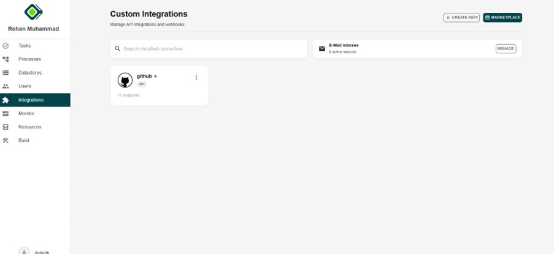

# MetamorphOS API Integration

MetamorphOS allows users to integrate their own external APIs into the platform. This enables the system to connect with third-party services and custom applications, allowing seamless data exchange and extended functionality. By integrating external APIs, users can automate workflows, retrieve or send data to other systems, and customize the platform according to their specific requirements. This flexibility allows MetamorphOS to adapt to different tools and services used within an organization.

Users can access integrations from the Integrations section, where two options are available:

1. **Marketplace Integrations**  
   The Marketplace provides a list of pre-configured integrations that can be quickly added to the platform.  
   Users can simply select an integration and add their API credentials to start using it.  
   Examples of available integrations include:  
   - Google Drive – Access and manage files stored in Google Drive.  
   - Google Calendar – Synchronize events and schedules.  
   - Gmail – Send, receive, and manage emails through the platform.  
   - Google Gemini – Utilize AI capabilities for automation and intelligent workflows.  

   To add an integration from the marketplace:
   
   1. Navigate to **Marketplace** in the **Integrations** section.  
   2. Select the desired service.  
   3. Click **Add**.  
   4. Click **Authenticate** or **Sign In**.  
   5. Provide the required **API Key** or authentication credentials.  
   6. Save the configuration to activate the integration.  

   Once configured, the integration becomes available for use within MetamorphOS workflows and automation processes.

2. **Create New Integration**  
    This option allows users to create a **custom integration** using their own **external API**.  

    With this option, users can:  
    - Connect **proprietary** or **third-party services**.  
    - Configure **API keys** and **authentication details**.  
    - Define **custom workflows** and **data exchanges**.  
    - Extend the platform according to specific **organizational requirements**.  

    This option is recommended when integrating **internal systems** or APIs that are **not available in the marketplace**.  

    You can also import your integrations using a **spec file** or **OpenAPI spec**.

# API Integration Configuration

After creating a new integration, users must configure the API connection by providing the required settings. This section allows users to define how **MetamorphOS** communicates with the external API.

---

## API Calls and Webhooks

The integration interface provides two main components:  

- **API Calls** – Used to define requests that MetamorphOS will send to the external API to retrieve or send data.  
- **Webhooks** – Used to receive real-time notifications or data from external systems when specific events occur.  

---

## Configuration

The **Configuration** section defines the core connection details for the external API.

### Base URL

The **Base URL** represents the root address of the external API.  

- All API endpoints will be built using this base URL.  
- It ensures that every request sent from MetamorphOS is directed to the correct API service.  

### Authentication

This section specifies the authentication method required to access the API.  

Depending on the external service, authentication may include:  

- **API Keys**  
- **OAuth**  
- **Basic Authentication**  

Proper authentication ensures that requests sent from MetamorphOS are authorized by the external system.  

---

## Endpoints

The **Endpoints** section allows users to define specific API routes that MetamorphOS will interact with.  

Users can:  

- Add new endpoints  
- Define request methods (**GET**, **POST**, **PUT**, **DELETE**)  
- Configure request parameters  
- Specify request bodies  
- Process API responses  

Each endpoint represents a specific action or operation performed through the external API.  

### To create a new endpoint:

1. Click the "+" icon in the Endpoints section.  
2. Enter the endpoint path and request method.  
3. Configure parameters, headers, and request body if required.  
4. Save the endpoint configuration.  

Once configured, these endpoints can be used within MetamorphOS workflows and automation processes.  

---

### Endpoint Configuration Fields

#### HTTP Method

The **HTTP method** defines the type of operation performed on the API.  

Common methods include:  

- **GET** – Retrieve data from the API  
- **POST** – Create new resources  
- **PUT/PATCH** – Update existing resources  
- **DELETE** – Remove resources  

#### Path

The **Path** specifies the API route relative to the Base URL.  

Dynamic parameters can be used with `${your_variable_name}` within the path to make the endpoint reusable.  

#### Request Parameters

The **Request Parameters** section defines the inputs required when calling the endpoint.  

Parameter types may include:  

- **PATH** – Parameters embedded in the endpoint URL  
- **BODY** – Parameters included in the request body  
- **QUERY** – Parameters appended to the URL as query strings  
- **HEADER** – Parameters included in request headers  

#### Response Schema

The **Response Schema** defines the structure of the data returned by the API.  

Users can:  

- Manually define response fields using **Add Field**  
- Automatically generate the schema using **From JSON** by pasting a sample API response  

This structured response allows the platform to map API data into workflows, automation tasks, or internal system components.  

The **File Response** option can be enabled when the API returns files instead of standard JSON data. This is useful for APIs that return downloadable content such as documents, images, or reports.  

#### Transform

Both **Request Parameters** and **Response Schema** provide a **Transform** option.  

This allows users to manipulate or format data before sending the request or after receiving the response.  

Transformations may include:  

- Data formatting  
- Field mapping  
- Data filtering  
- Value conversions  

---

After successfully configuring and saving the endpoint, the integration will become active within the system and the **green dot** appears indicating it is active. Once the setup is completed, the configured API call will appear in the **API Call** section of the integration dashboard.  

---

## Using Integrations in Workflows

Follow these steps to use an integration within a workflow:  

1. **Go to the Builder Dashboard**  
   Navigate to the Builder Dashboard, create new or use an existing process.  

2. **Add a New Step**  
   Right-click within the workflow canvas and select **Add Step**.  

3. **Open the Integration Panel**  
   From the available step options, select **Integration** from the top middle to open the integration panel.  

4. **Select an Integration**  
   The panel will display all available integrations that have been configured in the system.  

5. **Choose a Connector**  
   Click on the desired connector. A dropdown menu will appear showing all the available endpoints associated with that integration.  

6. **Select the Endpoint**  
   Choose the endpoint you want to use for the workflow action.  

7. **Add the Integration Step**  
   Click **Add** to include the selected integration endpoint in the workflow.  

Once added, the workflow will be able to execute the configured API call as part of its process.